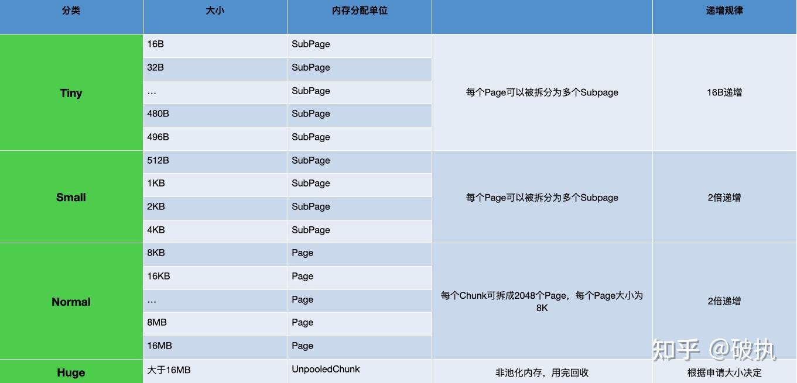
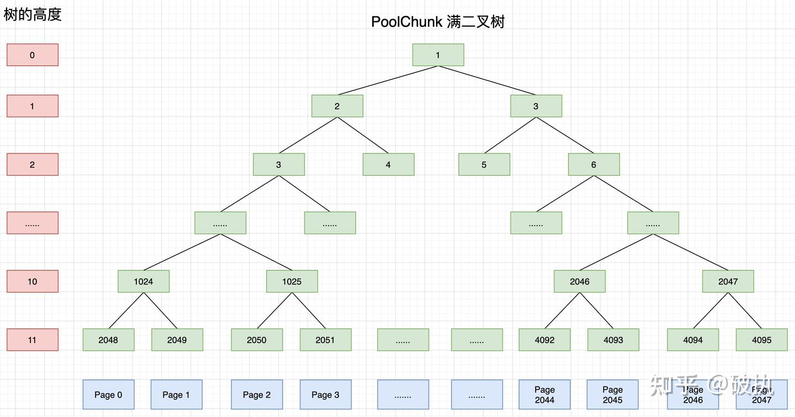
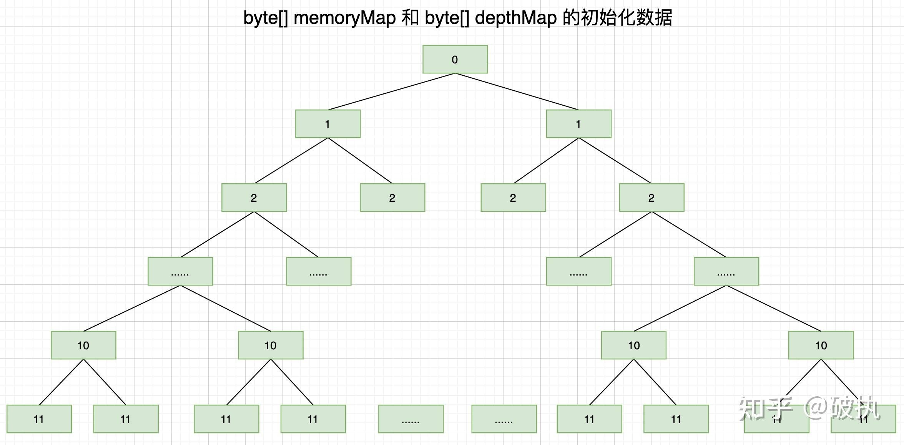
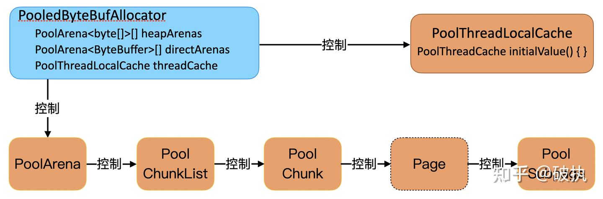
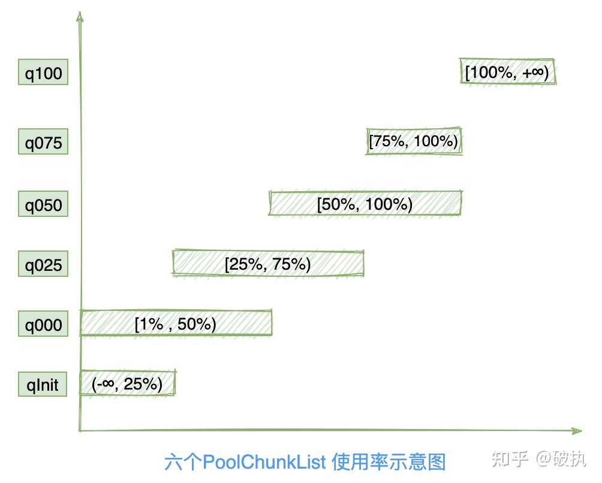
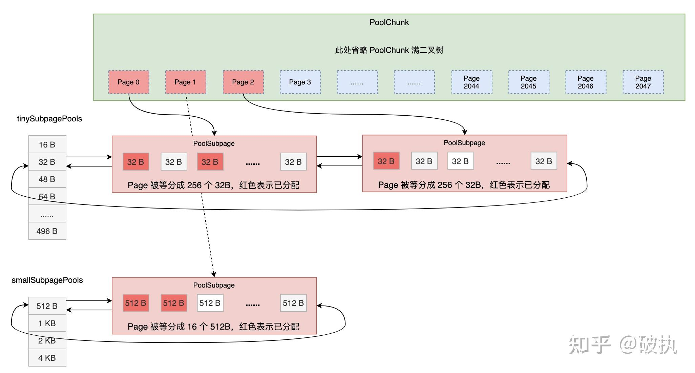
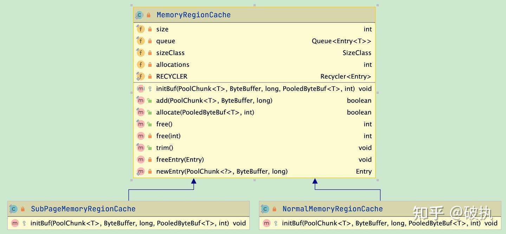
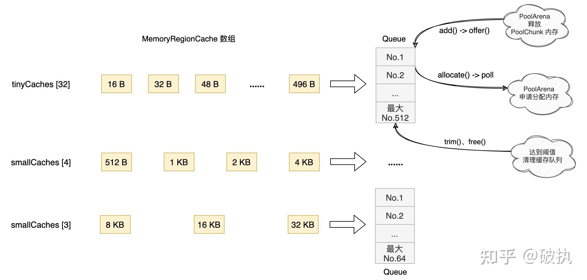
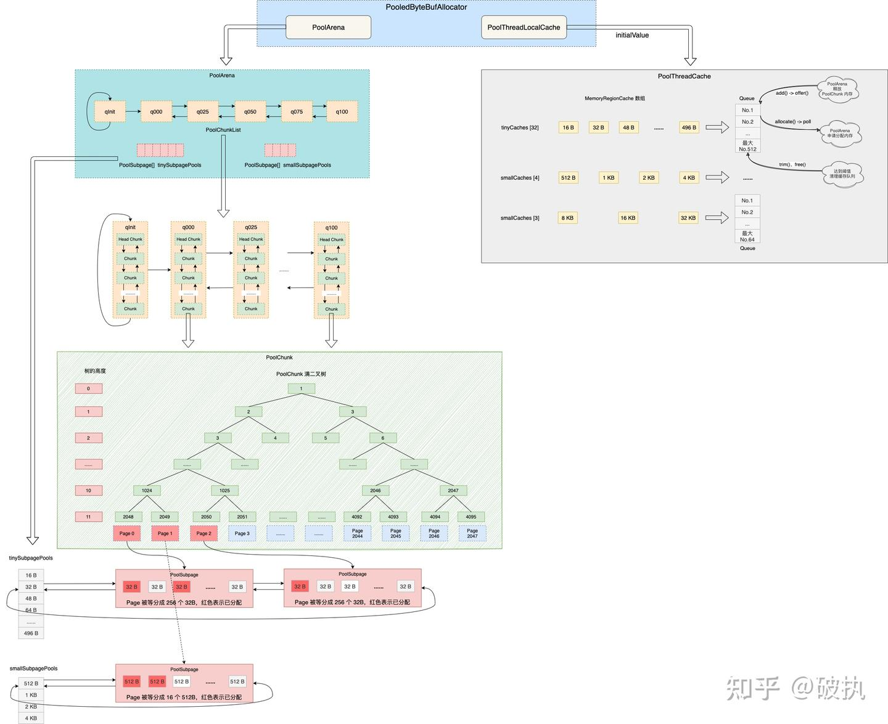
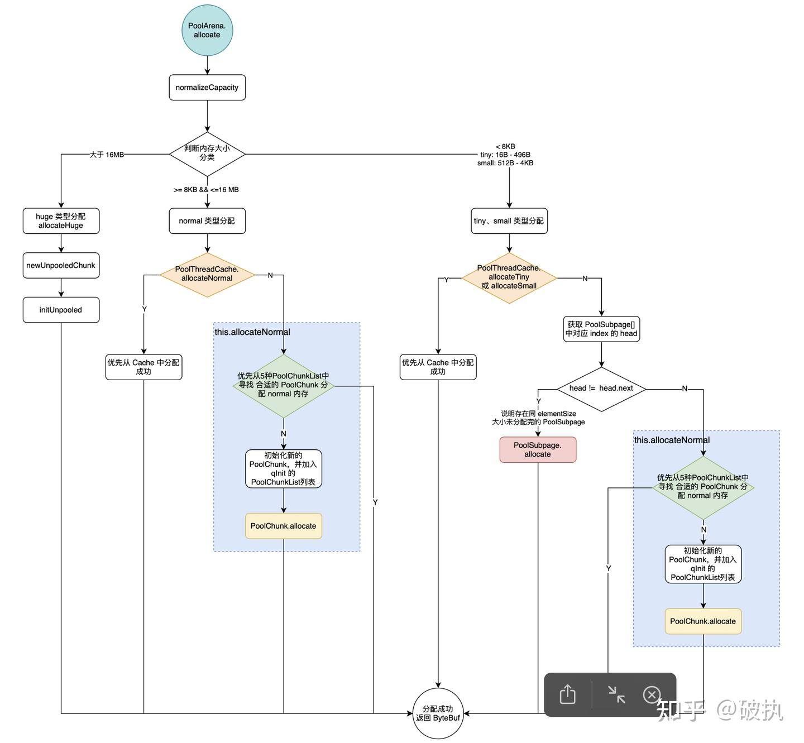

# Netty 内存

## 内存分配

为了分配的内存块尽可能保持连续、为了内存块能尽大程度的被利用、为了减少内部碎片，Netty 对内存规格进行了细致的划分。



上图第一列"分类"表示 Netty 对内存大小划分为：Tiny、Small、Normal 和 Huge 四类。

Netty 默认向操作系统申请的内存大小为 16MB，对于大于 16MB 的内存定义为 Huge 类型，认为是：大型内存不做缓存、不做池化，直接以 Unpool 的形式分配内存，用完后回收。

对于 16MB 及更小的内存，分类为：Tiny、Small、Normal，也有对应的枚举 SizeClass 进行描述。不过 Netty 定义了一套更细粒度的内存分配单位：Chunk、Page、Subpage，方便内存的管理。

`Chunk` 即上述提及的 Netty 向操作系统申请内存的单位，默认是 16MB。后续所有的内存分配也都是基于 Chunk 完成。Chunk 是 Page 的集合。

`Page` 是 Chunk 用于管理内存的基本单位。Page 的默认大小为 8KB，若欲申请 16KB，则需申请连续的两块空闲 Page。一个 Chunk（16MB），由 2048 个 Page （8KB）组成。

`SubPage` 是 Page 下的管理单位。对于底层应用，KB 级的内存已属于大内存的范畴，更多的是 B 级的小内存，直接使用`Page` 进行内存的分配，无疑是非常浪费的。所以对 Page 进行了切割划分，划分后的便是 SubPage，Tiny 和 Small 类型的内存使用的分配单位都是 SubPage。切割划分的算法原则是：如首次申请 512 B 的内存，则先申请一块 Page 内存，然后将 8 KB 的 Page 按照 512B 均分为 16 块，每一块可以认为是一个 SubPage，然后将第一块 SubPage 内存地址返回给申请方。同时下一次申请 512B 内存，则在 16 块中分配第二块。其他非 512B 的内存申请，则另外申请一个 Page 进行均等切分和分配。所以，对于 SubPage 没有固定的大小，和 Tiny、Small 中某个具体大小的内存申请有关。

PS：为什么只有上面穷举出来的内存大小，没有19B、21B、3KB这样规格？是因为 netty 中会把申请内存大小通过`io.netty.buffer.PoolArena#normalizeCapacity`方法进行了标准化，向上取整到最接近的上图中所列举出的大小，以便于管理。

## 伙伴算法

`Chunk`作为向操作系统申请内存的单位，`Page` 作为 Chunk 管理内存的基本单位。Chunk 是通过伙伴算法 (Buddy system) 管理 Page，每个 Chunk 划分成 2048 个 Page，最终通过一颗 depth = 12 的满二叉树（共4095个节点，仅2048个叶子作为 Page）实现。如下图所示：




高度为 11 的节点（2048 - 4095）即为 Page 节点，代表 8 KB ；

高度为 10 的节点（1024 - 2047）均拥有 2 个 Page 节点，代表16 KB；

高度为 1 的节点（2、3）均拥有 1024 个 Page 节点，代表 8 MB；

高度为 0 的节点（1）拥有 2048 个 Page 节点，代表 16 MB，即一个满 Chunk 的大小。



- memoryMap[] 和 depthMap[] 初识化完成时，如上图所示，数组 index 代表树的节点编号（从1开始，1-4095），数组 value 存出当前节点编号在树中的高度（从0开始，0-11）。两个数组的内容完全相同。
- depthMap[] 初始化完成后，便永远不会变化，仅用来通过节点编号快速获取树的高度。depthMap[1024]=10、depthMap[2048]=11，毕竟数组查询 O(1) 的时间复杂度，不需要每次在进行计算
- memoryMap[] 初识化完成后，根据节点的分配情况，value 值会进行相应的更改。以及根据 value 值判断该节点是否可以被分配。

memoryMap[] 中的 value 值从小到大，会有下述三种状态：

1. memoryMap[id] = depthMap[id] ，该节点没有被分配。如初始化完成时此种状态。
2. depthMap[id] < memoryMap[id] < 最大高度(12)。至少有一个子节点被分配，但尚未完全被分配，不能再分配该高度对应的内存，只能根据实际分配较小一些的内存。
3. memoryMap[id] = 最大高度(12) ，该节点及其子节点已被完全分配，没有剩余空间。

# PooledByteBufAllocator 核心



```java
// Heap 类型的 Arena 数量，默认（最小值）：2*CPU核数
private static final int DEFAULT_NUM_HEAP_ARENA; 
// direct 类型的 Arena 数量，默认（最小值）：2*CPU核数
private static final int DEFAULT_NUM_DIRECT_ARENA; 
// 默认 Page 的内存大小：8192B=8KB
private static final int DEFAULT_PAGE_SIZE; 
// 满二叉树的高度，默认为 11 。8192 << 11 = 16 MiB per chunk。
private static final int DEFAULT_MAX_ORDER; 
// PoolThreadCache 的 tiny 类型的内存块的缓存数量。默认为 512
private static final int DEFAULT_TINY_CACHE_SIZE; 
// PoolThreadCache 的 small 类型的内存块的缓存数量。默认为 256
private static final int DEFAULT_SMALL_CACHE_SIZE; 
// PoolThreadCache 的 normal 类型的内存块的缓存数量。默认为 64
private static final int DEFAULT_NORMAL_CACHE_SIZE; 
// PoolThreadCache 缓存的最大内存块的字节数，默认：32*1024
private static final int DEFAULT_MAX_CACHED_BUFFER_CAPACITY; 
// 是否使用PoolThreadCache。默认：true
 private static final boolean DEFAULT_USE_CACHE_FOR_ALL_THREADS; 

private final PoolArena<byte[]>[] heapArenas; // 默认值：DEFAULT_NUM_HEAP_ARENA
private final PoolArena<ByteBuffer>[] directArenas; // 默认值：DEFAULT_NUM_DIRECT_ARENA
private final int tinyCacheSize;     // 默认值：DEFAULT_TINY_CACHE_SIZE
private final int smallCacheSize;    // 默认值：DEFAULT_SMALL_CACHE_SIZE
private final int normalCacheSize;   // 默认值：DEFAULT_NORMAL_CACHE_SIZE
// ThreadLocal线程变量，用于获得 PoolThreadCache 对象。（大名鼎鼎的 FastThreadLocal）
private final PoolThreadLocalCache threadCache; 
private final int chunkSize; //  Chunk 大小，16MB
```

在 Netty 中如果需要进行池化的内存分配，代码可以这么写：

```java
// 倾向于 directBuffer 分配的池化分配器。【倾向】= 大多数情况是 directBuffer。部分场景是 heapBuffer
PooledByteBufAllocator pooledAllocator = PooledByteBufAllocator.DEFAULT;
// 默认分配器：PooledByteBufAllocator.DEFAULT。
// 若识别到当前 System 是安卓系统（相对服务器，内存资源较为宝贵），则默认：UnpooledByteBufAllocator.DEFAULT
PooledByteBufAllocator pooledAllocator2 = (PooledByteBufAllocator) ByteBufAllocator.DEFAULT;

// 申请 32KB 的 directBuffer。 默认：directBuffer 分配器。
ByteBuf byteBuf = pooledAllocator.buffer(1024 * 32);
// 申请 16KB 的 directBuffer
ByteBuf byteBuf2 = pooledAllocator2.directBuffer(1024 * 16);
// 申请 16KB 的 heapBuffer
ByteBuf byteBuf3 = pooledAllocator2.heapBuffer(1024 * 32);
```

上面 directBuffer() 方法经过简单的校验，最终会走到下面 newDirectBuffer() 这个方法，整体逻辑也很简单。

```java
protected ByteBuf newDirectBuffer(int initialCapacity, int maxCapacity) {
    // 从 ThreadLocal 中获得 PoolThreadCache 对象，并获得对应的 directArena 对象
    PoolThreadCache cache = threadCache.get();
    PoolArena<ByteBuffer> directArena = cache.directArena;

        // ...
    // 从 directArena 中分配内存，请见下文分解
    buf = directArena.allocate(cache, initialCapacity, maxCapacity);

  // ...
    // 将 ByteBuf 装饰成 LeakAware ( 可检测内存泄露 )的 ByteBuf 对象
    return toLeakAwareBuffer(buf);
}
```

**这里有个优秀的设计思想值得我们学习**。PoolArena\<ByteBuffer>[] directArenas 这个数组的大小是 2 * CPU 核数，在 ThreadLocal 初始化时会从 directArenas 数组中选取一个被线程引用最少的 PoolArena，这样做的目的是为了分散并发度，降低单个 PoolArena 的并发，缓解资源竞争的问题，以提高内存分配效率。

# PoolArena

```java
enum SizeClass {
    Tiny,       // 16B  - 496B  16B递增
    Small,      // 512B - 4KB   翻倍递增
    Normal      // 8KB  - 16MB  翻倍递增
    // 还有一个隐藏的，Huge     // 16MB - 更大  和申请容量有关
}

// Tiny类型内存区间：[16，496]，内存分配最小为16，每次增加16，直到496，共有31个不同的值
static final int numTinySubpagePools = 512 >>> 4;// tinySubpagePools数组的大小，默认：32
final int numSmallSubpagePools; // smallSubpagePools数组的大小，默认：pageShifts - 9 = 4
private final PoolSubpage<T>[] tinySubpagePools; // tiny 类型的 PoolSubpage 数组，每个元素都是双向链表。容量为32
private final PoolSubpage<T>[] smallSubpagePools;// small 类型的 PoolSubpage 数组，每个元素都是双向链表。容量为4

final PooledByteBufAllocator parent;    // 所属 PooledByteBufAllocator 对象
private final int maxOrder; // 满二叉树的高度（从0开始），默认：11
final int pageSize; // Page大小，默认：8KB
final int pageShifts; // 从 1 开始左移到 {@link #pageSize} 的位数。默认 13 ，1 << 13 = 8192
final int chunkSize;    // Chunk 内存块占用大小。8KB * 2048 = 16MB

private final PoolChunkList<T> q050; // 使用率 50% - 100% 的 Chunk 集合
private final PoolChunkList<T> q025; // 使用率 25% - 75% 的 Chunk 集合
private final PoolChunkList<T> q000; // 使用率 1% - 50% 的 Chunk 集合
private final PoolChunkList<T> qInit; // 使用率 MIN_VALUE - 25% 的 Chunk 集合
private final PoolChunkList<T> q075; // 使用率 75% - 100% 的 Chunk 集合
private final PoolChunkList<T> q100; // 使用率 100%+ 的 Chunk 集合

// 该 PoolArena 正在被多少线程同时引用
final AtomicInteger numThreadCaches = new AtomicInteger();
```

其中关键的数据结构是两个 PoolSubpage 数组和六个 PoolChunkList 双向链表。

## PoolArena 中的两个 PoolSubpage 数组

两个 PoolSubpage\<T> 数组正如属性名 tinySubpagePools、smallSubpagePools，是分别负责小于 8KB 的 tiny 和 small 类型的内存分配。

Tiny 类型内存区间：[16B，496B]，从 16B 开始，以 16B 递增，直到 496B，共有 31 个不同的值，tinySubpagePools 数组的大小为 numTinySubpagePools = 32。申请 tiny 内存时，根据 `PoolArena.tinyIdx`方法计算出在数组中的 index.

```java
// index：1 -> 31
static int tinyIdx(int normCapacity) {
        return normCapacity >>> 4;
}
```

Small 类型内存区间：512B、1KB、2KB、4KB，有 4 个不同的值，smallSubpagePools 数组的大小为 numSmallSubpagePools = 4。申请 small 内存时，根据 `PoolArena.smallIdx`方法计算出在数组中的 index.

```java
// index: 0 -> 3
static int smallIdx(int normCapacity) {
  int tableIdx = 0;
  int i = normCapacity >>> 10;
  while (i != 0) {
    i >>>= 1;
    tableIdx++;
  }
  return tableIdx;
}
```

PoolSubpage 对象本身也是个双向链表， tinySubpagePools、smallSubpagePools 两个数组在初识化时，每个 index 上初始化一个 prev 和 next 都指向自身 head 头结点。



注意：临界区的重叠是为了防止在内存分配和回收时两个紧邻 ChunkList 频繁移动，增加资源的消耗。

# PoolChunkList

## 为什么 ChunkList 分配内存的顺序是 q050、q025、q000、qInit、q075 ?

- q050 中 chunk 的内存使用率为：50%~100%，这大概是个折中的选择！这样大部分情况下，chunk 的使用率都会保持在一个较高水平，提高整个应用的内存使用率。避免频繁的创建和销毁，造成性能降低
- 为了保持较高的利用率，其次使用 q025 是个不错的选择
- qinit 和 q000 的 chunk 使用率低，但 qInit 中的 chunk 不会被回收，所以 q000 中若存在可分配的 chunk，则优先使用 q000
- q075 由于内存使用率偏高，在频繁分配内存的场景下可能导致分配成功率降低，因此放到最低优先级

```java
private final PoolArena<T> arena; // 所属 PoolArena 对象
    private final PoolChunkList<T> nextList; // 下一个 PoolChunkList 对象
    private final int minUsage; // Chunk 最小内存使用率,百分数（1-100）
    private final int maxUsage; // Chunk 最大内存使用率,百分数（1-100）
    private final int maxCapacity; // 每个 Chunk 最大可分配的容量。见：calculateMaxCapacity(int, int) 方法
    private PoolChunk<T> head; // PoolChunk 头节点

    // 当在PoolArena构造函数中创建类似链接的PoolChunkList时，只更新一次。
    // This is only update once when create the linked like list of PoolChunkList in PoolArena constructor.
    private PoolChunkList<T> prevList;
```


该类主要是用来维护我PoolChunk，核心方法如下

```java
boolean allocate(PooledByteBuf<T> buf, int reqCapacity, int normCapacity) {
    // 申请内存超过 Chunk 最大可分配的容量,直接返回失败
    if (normCapacity > maxCapacity) {
        return false;
    }

    // 遍历该 PoolChunkList 的内部 PoolChunk 的双向链表
    for (PoolChunk<T> cur = head; cur != null; cur = cur.next) {
        // 通过 PoolChunk 分配内存
        if (cur.allocate(buf, reqCapacity, normCapacity)) {
            if (cur.usage() >= maxUsage) {  // 使用率超过上限
                // 从当前 PoolChunkList 节点移除
                remove(cur);
                // 添加到下一个 PoolChunkList 节点
                nextList.add(cur);
            }
            return true;
        }
    }
    return false;
}
```

# PoolChunk

```java
final PoolArena<T> arena; // 所属 PoolArena 对象
private final byte[] memoryMap; // 分配信息满二叉树，index 为节点编号,默认长度为：4096
private final byte[] depthMap;  // 高度信息满二叉树，index 为节点编号,默认长度为：4096
private final PoolSubpage<T>[] subpages; // PoolSubpage 数组, 默认长度为：2048 (2048个叶子节点，每个节点的 Page 可都作为 Subpage 分配)

private final int pageSize; // Page 大小，默认 8KB = 8192B
private final int maxOrder; // 默认为 11。满二叉树的高度（从0开始，所以树高12）
private final int chunkSize; // Chunk 内存块占用大小。默认为 16M = 8KB * 2^11
private final Deque<ByteBuffer> cachedNioBuffers; // 下段源码中进行解释

PoolChunkList<T> parent; // 所属 PoolChunkList 对象
PoolChunk<T> prev;  // PoolChunk 的前驱节点
PoolChunk<T> next;  // PoolChunk 的后继节点
```

PoolChunk 的数据结构不难理解。上两章中都提及`初始分配 Tiny、Small` 和 `分配 Normal` 类型的内存时，最终都会调用到 PoolChunk 的 allocate 内存分配方法。下面看看它内部的流程：

```java
boolean allocate(PooledByteBuf<T> buf, int reqCapacity, int normCapacity) {
    final long handle;
    if ((normCapacity & subpageOverflowMask) != 0) { // >= pageSize(8KB)
        // 大于等于8KB时，为Normal，分配 Page 内存块
        handle = allocateRun(normCapacity);
    } else {
        // 小于8KB时，为Tiny/Small，分配 Subpage 内存块
        handle = allocateSubpage(normCapacity);
    }
    if (handle < 0) {
        return false;
    }
    ByteBuffer nioBuffer = cachedNioBuffers != null ? cachedNioBuffers.pollLast() : null;
    //  初始化内存块到 PooledByteBuf 对象中
    initBuf(buf, nioBuffer, handle, reqCapacity);
    return true;
}
```

```java
/**
 * 「(normCapacity & subpageOverflowMask) != 0」 方法解析：
 * <p>
 * subpageOverflowMask = ~(pageSize - 1); // ~(2^13-1) = 低13位都是0，高位全是1；
 * subpageOverflowMask = 11111111111111111110000000000000
 * normCapacity & subpageOverflowMask != 0时，说明第 14-31 位存在 1，即：normCapacity >= 2^13
 * </p>
 * 上述算法，相当于 ( length < pageSize ) 使用位运算的计算优化
 */
/**
 * Deque<ByteBuffer> cachedNioBuffers 是什么？
 * <p>
 * 用作从内存中创建的字节缓冲区的缓存，这些仅是复制品的，所以只是内存本身的一个容器。
 * 这些通常是 Pooled 池化 ByteBuf 中的操作所需要的，因此可能会产生额外的GC，通过缓存副本可以大大减少GC。
 * 如果PoolChunk是非池化的，这个值可能为空，因为非池化ByteBuffer实例在这里没有任何意义。
 * </p>
 */
```

## allocateNode

伙伴算法的具体实现：

```java
/**
 * normalizedCapacity -> depth 的转换分别在 allocateRun 和 allocateSubpage 中
 *
 * @param d 树的高度 depth (每层节点代表不同的内存大小)
 * @return index in memoryMap （1-4095）
 */
private int allocateNode(int d) {
    int id = 1; // 数组 index 代表树的节点编号（从1开始，1-4095）
    // 如：11111111111111111111100000000000  =-2048
    int initial = -(1 << d); // has last d bits = 0 and rest all = 1 最后的d位全是0，剩下的高位全是1
    byte val = memoryMap[id]; 
    // 如果根节点的值，大于 d ，说明，第 d 层没有符合的节点，也就是说 [0, d-1] 层也没有符合的节点。即，当前 Chunk 没有符合的节点。
    if (val > d) { // unusable
        return -1;
    }
    // 获得第 d 层，匹配的节点。
    // id & initial 来保证，高度小于 d 会继续循环
    while (val < d || (id & initial) == 0) { // id & initial == 1 << d for all ids at depth d, for < d it is 0
        id <<= 1;
        val = memoryMap[id];
        if (val > d) {
            id ^= 1;
            val = memoryMap[id];
        }
    }
    byte value = memoryMap[id];

    memoryMap[id] = unusable; // mark as unusable 标记为不可用
    updateParentsAlloc(id); // 递归更新父节点中的标记状态
    return id;
}
```

## allocateRun

allocateRun 用于的分配 >= 8KB 的 Normal 型内存。「内存规格划分」中提到 `Page 是 Chunk 用于管理内存的基本单位，Page 的默认大小为 8KB`，我们主观上**将 PoolChunk 满二叉树的 2048 个叶子节点称之为 Page** ，其实从 Netty 的注释中也可看出此观点（比如，allocateRun 方法的注释：allocate a run of page），但 Page 并非是一个真实存在的数据结构，这点要明确。同时，为什么这个方法叫分配 run ？ 其实，run 是为了和 jemalloc 中 run 进行的概念对齐。

流程非常简单：

- 先根据申请 capacity 计算出应该在 Poolchunk 满二叉树的第几层
- 根据层数（树高）通过 allocateNode 进行空闲节点的分配
- 重新计算 PoolChunk 空闲内存大小

```java
// Allocate a run of pages (>=1) 分配一串 Page
private long allocateRun(int normCapacity) {
    // 在树中的层级(maxOrder=11, pageShifts=13)
    int d = maxOrder - (log2(normCapacity) - pageShifts);
    // 获得节点
    int id = allocateNode(d);
    if (id < 0) {
        // 未获得到节点，直接返回
        return id;
    }
    // 减少剩余可用字节数
    freeBytes -= runLength(id);
    return id;
}
```

## allocateSubpage

llocateSubpage 用于的分配 < 8KB 的 Tiny 和 Small 型内存。流程相对比较复杂，我们逐一分解。

1. `arena.findSubpagePoolHead` ：可曾还记得 PoolArena 中的两个 PoolSubPage 数组 tinySubpagePools 和 smallSubpagePools；以及在 PoolArena 中分配 Tiny 和 Small 型内存时，会有第二优先级从 xxxSubPagePools 中寻找可用的 PoolSubPage 进行内存分配。这里就是在通过申请 capacity 从 tinySubpagePools 和 smallSubpagePools 找出对应的 PoolSubpage head 节点，方便后续的组织和分配
2. SubPage 只能由 8KB 的叶子节点 Page 进行 Page 进行了切割划分。所以这里只能找树高为 maxOrder 层的节点
3. 对 head 加锁后，通过 allocateNode 分配一个树高为 maxOrder 层的空闲节点，并记录 id（index in memoryMap 这里的叶子节点 id 范围：2048 - 4095）
4. PoolChunk 中有一个属性：**PoolSubpage\<T>[] subpages**。这个 PoolSubpage 数组长度为：2048 ，**初始化后为空数组**。即代表 PoolChunk 满二叉树的 2048 个叶子节点，每个空闲节点（ Page） 可都进行 Subpage 式的分配。
5. subpageIdx(id) 中用了巧妙的位运算进行 id(2048 - 4095) -> subpageIdx (0 - 2047) 的转换，subpageIdx 便是 PoolSubpage[] subpages 数组的 index
6. subpages[subpageIdx] 得到 PoolSubpage，判断是否为空
7. 为空，说明该 Page 节点未被以 SubPage 类型的内存规格分配过。创建 PoolSubpage 对象，并加入对应 xxxSubpagePools 中 head 节点之后。然后将 subpages[subpageIdx] 设置为新创建的 PoolSubpage 对象
8. 不为空，说明该 Page 节点曾经被 SubPage 类型的内存规格分配过。PoolSubpage 在实例化和 init 后，在堆内存中为对象本身分配了内存，一段时间后 PoolSubpage 对应的 Page 分配的内存（申请的 Netty 内存）被完全释放并从 PoolArena 的 xxxSubPagePools 双向链表中删除，此时 PoolSubpage 对象并不为null。这样做的目的是降低了 PoolSubpage 对象反复实例化和 GC 回收所带来的性能损耗。只需重新 init 即可（加入对应 xxxSubpagePools 中 head 节点之后）。
9. PoolSubpage 对象分配完成，调用 `PoolSubpage.allocate` 方法进行内存分配

```java
private long allocateSubpage(int normCapacity) {
  // 1、获得对应内存规格的 Subpage 双向链表的 head 节点
  PoolSubpage<T> head = arena.findSubpagePoolHead(normCapacity);
  // 2、获得最底层的一个节点。Subpage 只能使用二叉树的最底层的节点。
  int d = maxOrder; // subpages are only be allocated from pages i.e., leaves
  synchronized (head) {// 加锁，分配过程会修改双向链表的结构，会存在多线程的情况。
    int id = allocateNode(d); // 3、分配一个空闲叶子节点
    if (id < 0) {
      return id;
    }

    //  4、全局 PoolSubpage 数组
    final PoolSubpage<T>[] subpages = this.subpages;
    final int pageSize = this.pageSize;

    freeBytes -= pageSize;// 减去分配的 8KB

    // 获得节点对应的 subpages 数组的编号
    int subpageIdx = subpageIdx(id);
    // 获得节点对应的 subpages 数组的 PoolSubpage 对象
    PoolSubpage<T> subpage = subpages[subpageIdx];
    if (subpage == null) { // 5、判断 subpage 是否存在
      // 5.1、不存在，则进行创建 PoolSubpage 对象
      subpage = new PoolSubpage<T>(head, this, id, runOffset(id), pageSize, normCapacity);
      subpages[subpageIdx] = subpage;
    } else {
      // 5.2、存在，则重新初始化 PoolSubpage 对象
      subpage.init(head, normCapacity);
    }
    // 6、分配 PoolSubpage 内存块
    return subpage.allocate();
  }
}
```


# PoolSubpage

在小内存（小于 Page = 8KB 的 Tiny、Small）分配的场景下，会使用 PoolSubpage 进行管理。首先看下 PoolSubpage 的属性定义：

```java
/**
 * Subpage 位图分布信息数组，数组长度为：8
 * 1 个 long 8 字节、64 位，即一个 long 可表示 64 个萝卜坑是否被占用。那么长度为 8 的 long 数组，最多可表示 512 个坑
 * 最小的 Subpage=16B，pageSize=8KB,那么：8KB / 16B = 512个，单个 Page 最多可分成 512 个 SubPage。使用数组长度为 8 的 long 数组，正好最多表示 512 的位图。
 */
private final long[] bitmap; // Subpage 位图分布，用以表示对应节点的分配与否
private int bitmapLength;   // bitmap 数组的真正使用的数组大小（1-8）
final PoolChunk<T> chunk; // 所属 PoolChunk 对象
private final int memoryMapIdx; //  分配信息满二叉树中的节点编号

PoolSubpage<T> prev;    // 双向链表，前一个 PoolSubpage 对象
PoolSubpage<T> next;    // 双向链表，后一个 PoolSubpage 对象

int elemSize;           // Subpage 对应某一个 Tiny/Small 的具体内存大小
private int maxNumElems;    // Page 被分成多少个 Subpage。 8K / elemSize
private int nextAvail;      // 下一个可分配 Subpage 的数组位置
private int numAvail;       // Page 下剩余可分配 Subpage 的数量
```

上述这些属性会在 PoolSubpage 实例化和 init 初始化时完成赋值，并在 init 时将该 PoolSubpage 加入到 tinySubpagePools 或 smallSubpagePools 数组中对应位置的 head 节点之后。（allocatePoolSubpage 章中步骤 5 的流程）

allocate：

`PoolSubpage.allocate` 中没有过于复杂的逻辑，只是将 Page 按申请内存时指定的 capacity（elementSize）等分成 maxNumElems 份，后续申请同等 elementSize 的内存时，即可从已等分好的中获取。通过 bitmap 位图的方式巧妙的管理这 maxNumElems 份 Subpage，分配后打个标，释放后取消标记。流程不太复杂，只是大量逻辑使用了位运算，看起来稍显晦涩，有兴趣的可以追一下 getNextAvail 及内部方法、释放内存的 free 方法，基本全是位运算。

```java
// 返回 subpage 分配的位图索引的内存地址
long allocate() {
    // 可用数量为 0 ，或者已销毁，返回 -1 ，即不可分配。
    if (numAvail == 0 || !doNotDestroy) {
        return -1;
    }
    // 获得下一个可用的 Subpage 在整个位图中的位置（0 ~ 511）
    final int bitmapIdx = getNextAvail();
    // 获得下一个可用的 Subpage 在 bitmap 数组中的 index（0 ~ 7）
    int q = bitmapIdx >>> 6;
    // 获得下一个可用的 Subpage 在 bitmap 数组中 long 的第几 bits（0 ~ 63）
    int r = bitmapIdx & 63;
    assert (bitmap[q] >>> r & 1) == 0;
    // 将位图中对应的 bit 位置为：已分配。
    bitmap[q] |= 1L << r;
    // 剩余可用 Subpage 的数量
    if (--numAvail == 0) {
        // 若减完后为0，代表无可用 Subpage 内存块。从双向链表中移除
        removeFromPool();
    }
    // 计算 bitmapIdx 的内存地址
    return toHandle(bitmapIdx);
}
```

# PoolChunk 架构图

Subpage 是由 PoolChunk 中的一个空闲 Page 依照第一次请求分配的内存大小（仅限 Tiny 和 Small ）均等切分而成。比如，第一次请求分配 16B，则 Page 按照 16B 均等切分为 512 块；第一次请求 512B，则 Page 按照 512B 均等分为 16 块。

1、首次请求 PoolArena 分配，PoolArena 中的 tinySubpagePools 或 smallSubpagePools 双向链表为空（只有无含义的 head 节点），不能分配；那么下沉给 PoolChunk 分配，PoolChunk 在满二叉树中找到一个空闲的叶子节点 Page ，然后均等切分并加入到 PoolArena 的 xxxSubpagePools 链表中，最后分配满足要求的内存

2、若之后请求分配同样大小的内存，则直接在 PoolArena 中的 xxxSubpagePools 双向链表中已切分好的 PoolSubPage 进行分配；如果链表中的节点都没有空间分配，则重复步骤 1 中的后半部分

3、若之后请求分配不同大小的 Tiny 或 Small 内存，则重复步骤 1 中的后半部分



# PoolThreadCache

PoolArena 的分配流程中提及了 PoolTheadCache 的 allocateNormal、allocateTiny 和 allocateSmall 流程。下面我们就分析一下 PoolThreadCache ，它有如下核心属性：

```java
final PoolArena<byte[]> heapArena;  // 所属 heap 的 PoolArena 对象
final PoolArena<ByteBuffer> directArena;  // 所属 direct 的 PoolArena对象

// 不同类型内存块的缓存数组
// 默认大小：32；cache[0] = 16B、cache[1] = 32B........、cache[31] = 496B
private final MemoryRegionCache<ByteBuffer>[] tinySubPageDirectCaches;
// 默认大小：4； cache[0] = 512B、cache[1] = 1KB、cache[2] = 2KB、cache[2] = 4KB
private final MemoryRegionCache<ByteBuffer>[] smallSubPageDirectCaches;
// 默认大小：3； cache[0] = 8KB、cache[1] = 16KB、cache[2] = 32KB。64Kb及以上，不走缓存
private final MemoryRegionCache<ByteBuffer>[] normalDirectCaches;

private int allocations;// 当前已分配次数（注意：次数，并非节点数）
//  allocations 到达该阀值时，（所有不同类型内存块的缓存数组中）没有被分配出去的缓存空间都要被释放，调用trim()方法释放缓存，默认：8192次
private final int freeSweepAllocationThreshold;

// 同：xxxDirectCaches
private final MemoryRegionCache<byte[]>[] tinySubPageHeapCaches; 
private final MemoryRegionCache<byte[]>[] smallSubPageHeapCaches; 
private final MemoryRegionCache<byte[]>[] normalHeapCaches;
```

从属性中可以看到又出现了一个没见过的数据结构：`MemoryRegionCache`。对 heap 和 direct 类型的内存分别有 tiny、small、normal 是那种 MemoryRegionCache 数组进行支持。

**数组中每个 MemoryRegionCache 元素，分别对 16B - 32KB 中每种内存大小的内存块进行单独管理。**

## MemoryRegionCache



`MemoryRegionCache` 是 PoolThreadCache 中抽象内部类，它是内存块通过缓存方式进行分配的核心类。

核心属性：

- `Queue<Entry<T>> queue`：用来缓存内存块的队列
- 通过`PlatformDependent.newFixedMpscQueue(this.size)` 初始化。之所以使用 Multi-Producer-Single-Consumer 这种队列是因为：ByteBuf 的分配和释放可能在不同的线程中，这里的多生产者即多个不同的释放线程，这样才能保证多个释放线程同时释放的 ByteBuf 能高效添加到队列中
- `int size`：queue 队列的大小，即能缓存内存块的最大个数，防止无限制缓存而造成溢出
- tiny、small、normal 内存规格的队列大小分别为：512、256、64
- 初始化时的大小，来源于：PooledByteBufAllocator#DEFAULT_TINY_CACHE_SIZE、DEFAULT_SMALL_CACHE_SIZE、DEFAULT_NORMAL_CACHE_SIZE
- `SizeClass sizeClass`：内存规格：tiny、small、normal
- `int allocations`：已分配次数（达到一定条件会触发清理，清理后重置为0）

核心方法：

- `initBuf` ：内存地址分配，初始化 PooledByteBuf 对象的核心方法。Subpage （包括 tiny 和 small 内存块）的内存分配方式 和 Page （normal 内存块）的管理分配方式存在差异， 这里做成抽象方法。通过 `SubpageMemoryRegionCache` 和 `NormalMemoryRegionCache` 继承 `MemoryRegionCache` 分开实现
- `add` ：加入队列，进行缓存
- PoolArena#free 释放内存块时，将符合条件的加入队列中，进行缓存
- 如果队列满了或添加失败，则直接将内存块回收掉
- `allocate`：分配已缓存的内存块
- `trim`、`free`、`freeEntry`：释放已缓存的内存块，防止发生内存泄露
- 当分配操作达到一定阈值（默认：freeSweepAllocationThreshold = 8192）时，没有被分配出去的缓存空间都要被释放，以防止内存泄漏。
- 当长时间 size > allocations 时，说明缓存使用的次数较少。缓存的设计本来是为了能频繁使用，这样缓存所占的空间才能有效提高效率。如果分配次数较少，则根据一定策略应该释放这部分空间，防止内存占据过多（tiny 缓存的 512 个节点、small缓存的 256 个节点、normal 缓存的 64 个节点）。

## Init


ByteBufAllocator 中介绍 PooledByteBufAllocator 有一个属性：继承于 FastThreadLocal 的 `PoolThreadLocalCache`（注意它不是 PoolThreadCache）。在 PooledByteBufAllocator 实例化时会将其实例化，后续在首次使用 PoolThreadLocalCache#get 时出触发 initValue 方法。**正是在 PoolThreadLocalCache#initValue 时，会进行 PoolThreadCache 的初始实例化。**PoolThreadCache 的实例化主要进行本章开头介绍它的核心属性的初始化。伪代码解析如下：

```java
/**
 * @param tinyCacheSize tiny 内存块缓存数组中queue队列的大小。来自于 PooledByteBufAllocator#tinyCacheSize， 512
 * @param smallCacheSize small 内存块缓存数组中queue队列的大小。来自于 PooledByteBufAllocator#smallCacheSize，256
 * @param normalCacheSize normal 内存块缓存数组中queue队列的大小。来自于 PooledByteBufAllocator#normalCacheSize，64
 * @param maxCachedBufferCapacity 最大能支持缓存 normal 的内存大小，默认：32KB。来自于 PooledByteBufAllocator#DEFAULT_MAX_CACHED_BUFFER_CAPACITY
 * @param freeSweepAllocationThreshold 8192，来自于 PooledByteBufAllocator#DEFAULT_CACHE_TRIM_INTERVAL
 */
PoolThreadCache(PoolArena<byte[]> heapArena, PoolArena<ByteBuffer> directArena,
                int tinyCacheSize, int smallCacheSize, int normalCacheSize,
                int maxCachedBufferCapacity, int freeSweepAllocationThreshold) {
    // ......
    this.freeSweepAllocationThreshold = freeSweepAllocationThreshold;
    this.heapArena = heapArena;
    this.directArena = directArena;

    // tiny 缓存数组初始化
    tinySubPageDirectCaches = createSubPageCaches(tinyCacheSize, PoolArena.numTinySubpagePools, SizeClass.Tiny);
    // small 缓存数组初始化
    smallSubPageDirectCaches = createSubPageCaches(smallCacheSize, directArena.numSmallSubpagePools, SizeClass.Small);
    // mormal 缓存数组初始化  
    numShiftsNormalDirect = log2(directArena.pageSize); // 13。用于计算数组中的位置
    normalDirectCaches = createNormalCaches(normalCacheSize, maxCachedBufferCapacity, directArena);

    // 更新对应 PoolArena 的线程引用计数器
    directArena.numThreadCaches.getAndIncrement();
    // ......
}
```

createSubPageCaches 和 createNormalCaches 中做的事情其实不复杂，即创建对应的 MemoryRegionCache 数组。方法传入或计算出 **SizeClass、 numCaches（数组的大小） 和 cacheSize（MemoryRegionCache 中 队列的大小）**。最终结果：

- MemoryRegionCache[] tinySubPageDirectCaches // 数组大小32，MemoryRegionCache 队列大小：512
- MemoryRegionCache[] smallSubPageDirectCaches // 数组大小4，MemoryRegionCache 队列大小：256
- MemoryRegionCache[] normalSubPageDirectCaches // 数组大小3，MemoryRegionCache 队列大小：64

重复一句：**数组中每个 MemoryRegionCache 元素，分别对 16B - 32KB 中每种内存大小的内存块进行单独管理。**


## PoolThreadCache 的分配流程

再让我们回顾一下 PoolArena 中的流程，我们这时便重点关注 PoolThreadCache 的 allocateNormal、 allocateTiny、 allocateSmall 方法。

根据 MemoryRegionCache 的介绍，其实不妨大胆猜想：allocateNormal、 allocateTiny、 allocateSmall 方法底层逻辑都是在使用 MemoryRegionCache#allocate 方法，从 Queue 队列中 poll 出缓存的内存块。下面 show code ：

```java
boolean allocateTiny(PoolArena<?> area, PooledByteBuf<?> buf, int reqCapacity, int normCapacity) {
    // cacheForTiny: 从 tinySubPageDirectCaches 数组中找出申请内存块大小的 index 的元素
    return allocate(cacheForTiny(area, normCapacity), buf, reqCapacity);
}

boolean allocateSmall(PoolArena<?> area, PooledByteBuf<?> buf, int reqCapacity, int normCapacity) {
    // cacheForTiny: 从 smallSubPageDirectCaches 数组中找出申请内存块大小的 index 的元素
    return allocate(cacheForSmall(area, normCapacity), buf, reqCapacity);
}

boolean allocateNormal(PoolArena<?> area, PooledByteBuf<?> buf, int reqCapacity, int normCapacity) {
    // cacheForTiny: 从 normalSubPageDirectCaches 数组中找出申请内存块大小的 index 的元素
    return allocate(cacheForNormal(area, normCapacity), buf, reqCapacity);
}

// 三分归元，最终还是来到了 PoolThreadCache 的 allocate
private boolean allocate(MemoryRegionCache<?> cache, PooledByteBuf buf, int reqCapacity) {
    if (cache == null) { return false; }

    // 入参 MemoryRegionCache 的 allocate 方法
    boolean allocated = cache.allocate(buf, reqCapacity);
    // 增加 allocations 计数。若达到 freeSweepAllocationThreshold 阀值(8192)，重置计数，调用trim方法，整理缓存
    if (++allocations >= freeSweepAllocationThreshold) {
        allocations = 0;
        trim();
    }
    return allocated;
}
```

## PoolThreadCache 总结

PoolThreadCache 的重点可归结为下图：



PoolThreadCache 为什么这么设计，也一目了然。

- 在释放已分配的内存块时，不放回到 Chunk 中，而是缓存到 ThreadCache 中
- 在分配内存块时，优先从 ThreadCache 获取。若无法获取到，再从 Chunk 中分配
- 通过这样的方式，既能提高分配效率，又尽可能的避免多线程的同步和竞争

最后补充下 PoolThreadCache 类的一段注释：

```text
/**
 * PoolThreadCache 充当分配的线程缓存。该实现是在jemalloc和使用jemalloc的可伸缩内存分配技术之后抽出来的模块
 * Acts a Thread cache for allocations. This implementation is moduled after
 * <a href="http://people.freebsd.org/~jasone/jemalloc/bsdcan2006/jemalloc.pdf">jemalloc</a> and the descripted
 * technics of
 * <a href="https://www.facebook.com/notes/facebook-engineering/scalable-memory-allocation-using-jemalloc/480222803919">
 * Scalable memory allocation using jemalloc</a>.
 */
```


# 总结

在 ByteBufAllocator 章节中用了下面这幅图，来表达 Netty 内存管理中各组件关系。


## 详细内存管理图：





## 内存分配的流程图：




参考：https://zhuanlan.zhihu.com/p/422289486