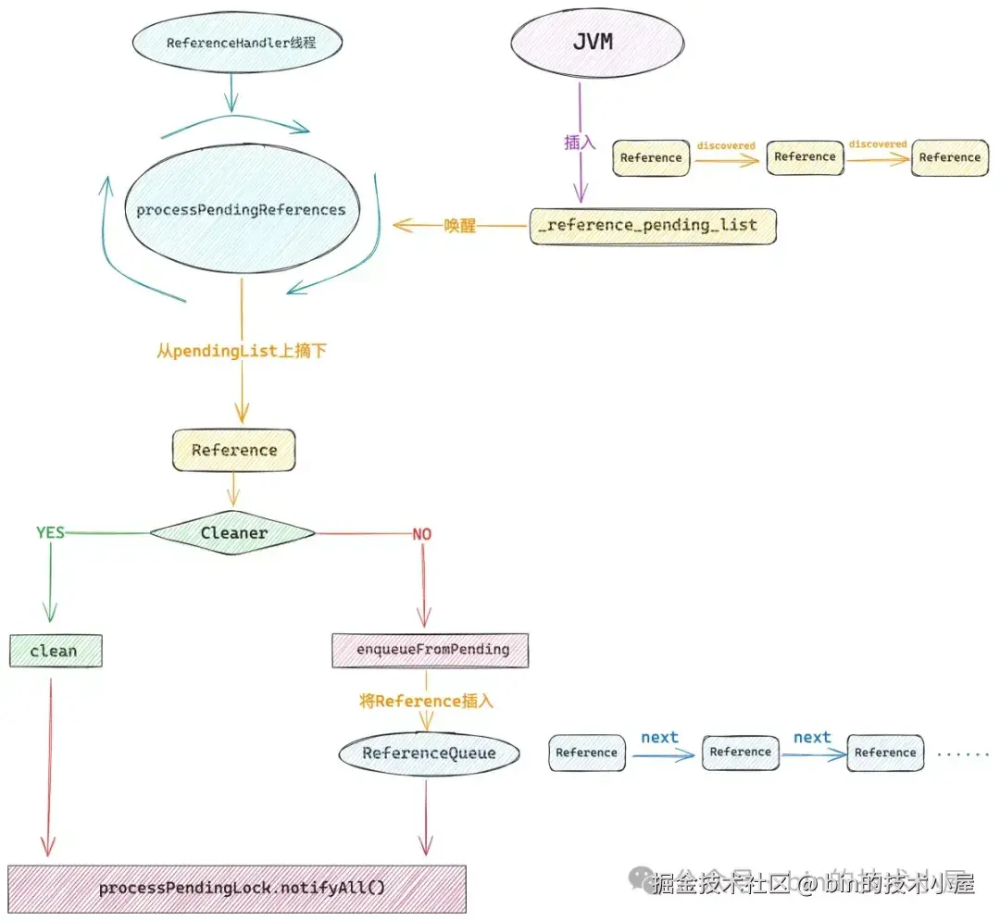

# 对象回收过程

## 普通对象

1. **标记阶段**：
   - 对象A未被任何GC Roots引用，标记为垃圾。
2. **清理阶段**：
   - 若未覆盖`finalize()`：直接回收内存。
   - 若覆盖`finalize()`：
     a. 对象A加入`F-Queue`。
     b. Finalizer线程异步调用`finalize()`。
     c. 若`finalize()`中重新建立强引用，对象A复活；否则下次GC时回收。

## 特殊引用对象

1. **`Cleaner` 的组成**：

   - 继承自`PhantomReference`，内部封装清理任务（如关闭文件句柄）。

   - 示例代码：

     ```
     Cleaner.create(obj, () -> closeResource()); // 注册清理动作
     ```

2. **回收触发流程**：
   a. 对象A被标记为垃圾 → 其关联的`Cleaner`（虚引用）被加入`reference_pending_list`。
   b. **`ReferenceHandler`线程**：

   - 监控`reference_pending_list`，将`Cleaner`转移到对应`ReferenceQueue`。
   - 调用`Cleaner.clean()`执行注册的清理任务（如`closeResource()`）

   c.  对象A的内存最终被GC回收。

3. `reference_pending_list` 的作用

- **全局待处理列表**：
  JVM将待处理的引用对象（包括`Cleaner`、`WeakReference`等）临时存入该列表。
- **处理线程**：
  `ReferenceHandler`线程（每个JVM实例一个）负责将引用从`reference_pending_list`转移到各自的`ReferenceQueue`。

## GC处理流程图：


# Netty 内存泄露检测原理

**原理：**

​	Netty内存检测是基于上面的cleaner，如果对象是被GC了，那么它会将对象放入到ReferenceQueue队列中，那么在`reportLeak`方法中拿到这个队列，从这个队列中获取对象DefaultResourceLeak，并且继续检测allLeaks的集合中是否存在这个对象，如何不存在说明已经被释放了。如何存在那么说明这个对象没有被释放，那么获取访问的堆栈，并打印告警信息。

ResourceLeakDetector 中封装了内存泄露探测所需要的所有信息，其中最重要的就是 **allLeaks** 和 **refQueue** 这两个集合，allLeaks 主要用于保存所有未被释放的 ByteBuf 对应的弱引用 DefaultResourceLeak，在 ByteBuf 被创建之后，Netty 就会为其创建一个 DefaultResourceLeak 实例来弱引用 ByteBuf，同时这个 DefaultResourceLeak 会被添加到这里的 allLeaks 中。


首先：什么时候需要内存检测：只有当ByteBuf对象，不再被引用了，那么就需要回收，

> GC都回收了对象，为什么还需要对进行内存泄露检测，
>
> 因为：对象回收了，但是它所申请的内存没有被release或者没还回去去。
>
> 比如还到Pooled池化的对象中，或者申请的堆外内存没有释放释放掉，如果是大对象的话。


检测流程：

当JVM回收了ByteBuf对象之后，JVM会将对象放入到_reference_pending_list，随后唤醒ReferenceHandler线程将对象从_reference_pending_list中转移到refQueue。

但是它这个对象还被Netty缓存在AllLeaks集合中。

如下图：


如果这个 SimpleLeakAwareByteBuf 忘记释放了，那么它对应的 DefaultResourceLeak 就会一直停留在 allLeaks 集合中，当 SimpleLeakAwareByteBuf 被 GC 之后，JVM 就会将 DefaultResourceLeak 放入到 _reference_pending_list 中，随后唤醒 ReferenceHandler 线程将 DefaultResourceLeak 从 _reference_pending_list 中转移到 refQueue。


什么时候进行探测：

当某一个普通的 Java 线程在向 Netty 申请 DirectByteBuf 的时候，这个申请内存的线程就会顺带到 ReferenceQueue 中查看一下是否有 DefaultResourceLeak 对象，如果有，那么就证明被其弱引用的 DirectByteBuf 已经被 GC 了。

紧接着，就会查看这个 DefaultResourceLeak 对象是否仍然停留在 allLeaks 集合中 ，如果还在，那么就说明 DirectByteBuf 背后的 Native Memory 仍然没有被释放，这样一来 Netty 就探测到了内存泄露的发生。

## reportLeak

核心代码：

```java
 private void reportLeak() {
        // 日志级别必须是 Error 级别
        if (!needReport()) {
            clearRefQueue();
            return;
        }

        // Detect and report previous leaks.
        for (;;) {
            // 对应的 ByteBuf 必须已经被 GC 回收，才会触发内存泄露的探测
            DefaultResourceLeak ref = (DefaultResourceLeak) refQueue.poll();
            if (ref == null) {
                break;
            }
            // 检查 ByteBuf 对应的 DefaultResourceLeak 是否仍然停留在 allLeaks 集合中
            if (!ref.dispose()) {
                // 如果不存在，则说明 ByteBuf 已经被及时的释放了，不存在内存泄露
                continue;
            }
            // 当探测到 ByteBuf 发生内存泄露之后，这里会获取 ByteBuf 相关的访问堆栈 
            String records = ref.getReportAndClearRecords();
            if (reportedLeaks.add(records)) { // 去重泄露日志
                // 打印泄露的堆栈路径
                if (records.isEmpty()) {
                    reportUntracedLeak(resourceType);
                } else {
                    reportTracedLeak(resourceType, records);
                }
                // 回调 LeakListener
                LeakListener listener = leakListener;
                if (listener != null) {
                    listener.onLeak(resourceType, records);
                }
            }
        }
    }
```

流程图：



## 如何生成泄露堆栈


ByteBuf 发生内存泄露之后，Netty 又是如何生成相关的泄露堆栈呢 ？

这就要依靠 DefaultResourceLeak 中的这个 TraceRecord 栈结构，栈顶 TraceRecord 永远保存的是 ByteBuf 最近一次的访问堆栈，栈底 TraceRecord 永远保存的是 ByteBuf 起始创建位置堆栈，中间的 TraceRecord 记录的是 ByteBuf 的访问链路堆栈。


如果应用程序及时的释放了 ByteBuf ， 那么对应的 DefaultResourceLeak 也会从 allLeaks 中删除，如果 ByteBuf 被 GC 之后，其对应的 DefaultResourceLeak 仍然停留在 allLeaks 中，那么就说明该 ByteBuf 发生泄露了。

```java
```


要想触发 Netty 的内存泄露探测机制需要同时满足以下五个条件：

1. 应用必须开启内存泄露探测功能。
2. 必须要等到 ByteBuf 被 GC 之后，内存泄露才能探测的到，如果 GC 一直没有触发，那么即使是 ByteBuf 没有任何强引用或者软引用了，内存泄露的探测也将无从谈起。
3. 当 GC 发生之后，必须是要等到下一次分配内存的时候，才会触发内存泄露的探测。如果没有内存申请的行为发生，那么内存泄露的探测也不会发生。
4. Netty 并不会探测每一个 ByteBuf 的泄露情况，而是根据一定的采样间隔，进行采样探测。所以要想触发内存泄露的探测，还需要达到一定的采样间隔。
5. 应用的日志级别必须开启 Error 级别，因为内存泄露的报告，Netty 是以 Error 级别的日志输出出来的，如果日志级别在 Error 以下，那么内存泄露的报告则无法输出。


Ref ：https://juejin.cn/post/7434191897617154111