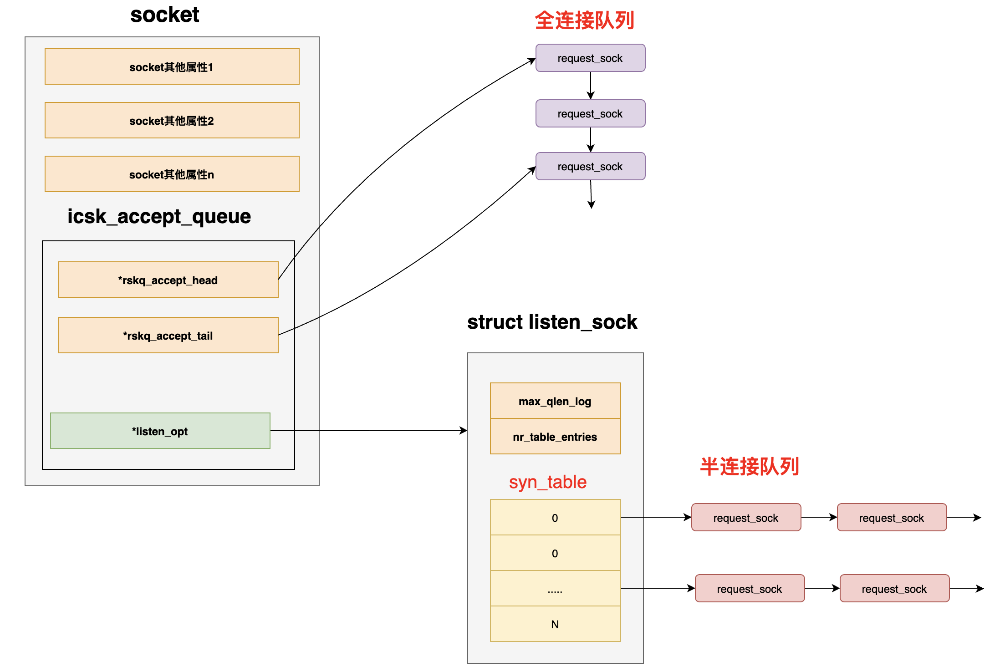
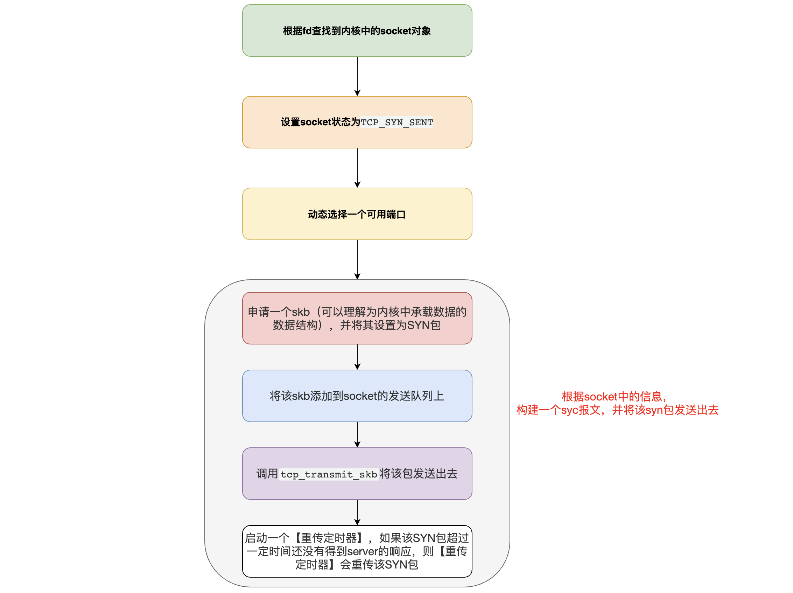
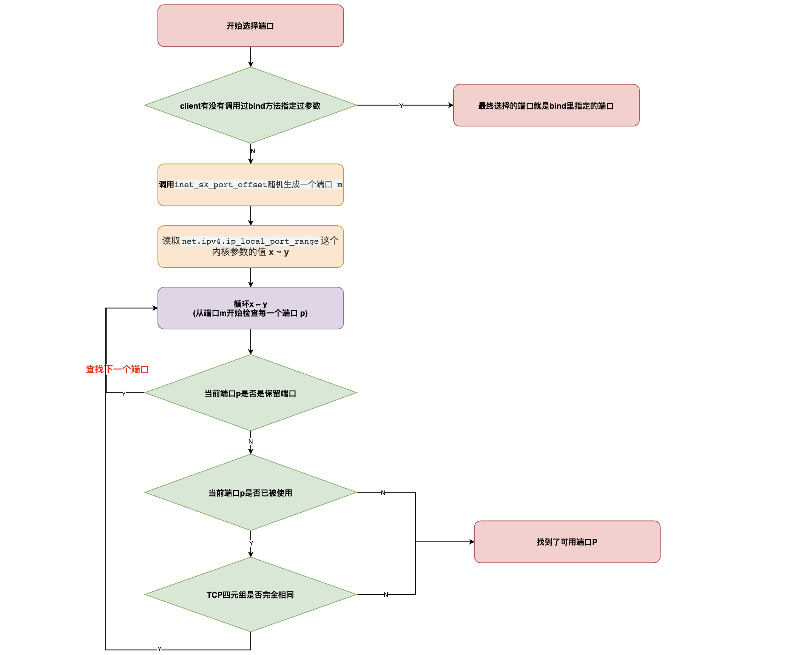
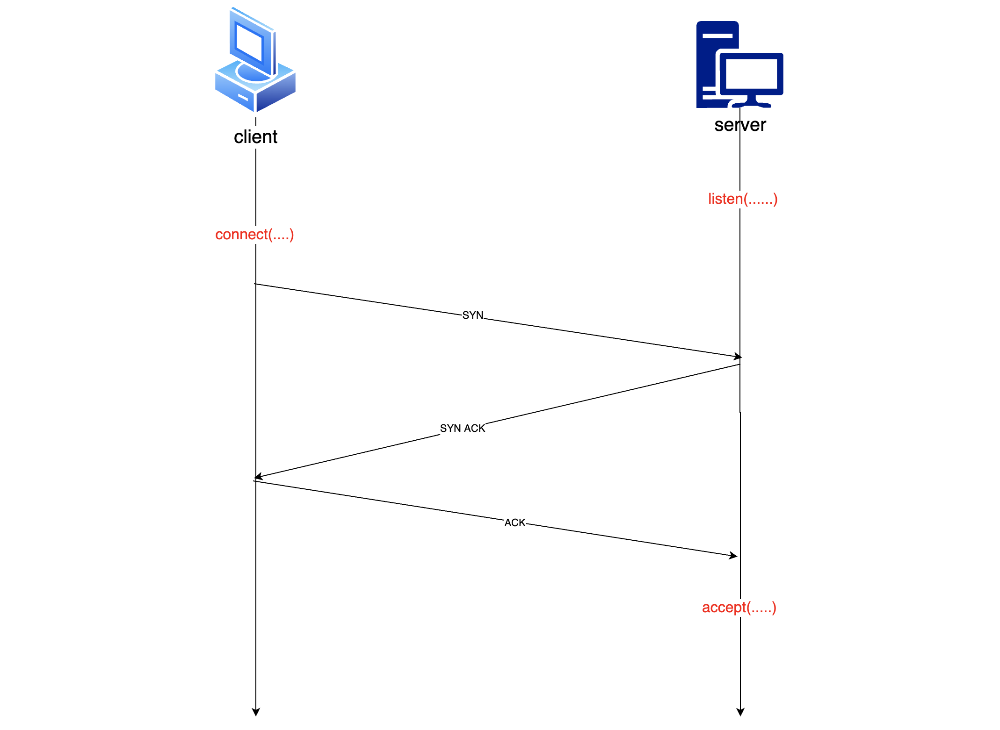
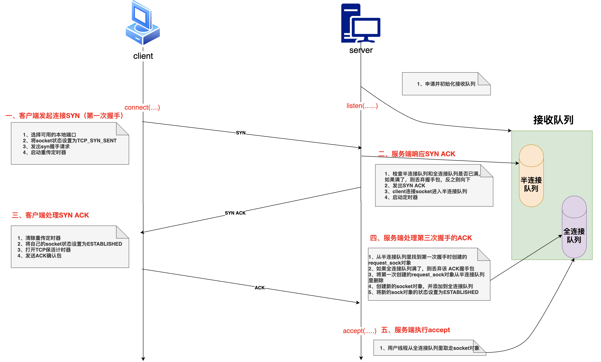

# 一、深入理解listen

在服务端程序里，在开始接收请求之前都需要执行一下listen系统调用。那么listen到底是干了什么呢？

## 1、看看半连接队列和全连接队列在内核socket的数据结构

这里主要是介绍socket里的【全连接队列】和【半连接队列】结构，所以socket里的其他属性结构就不详细展示了（比如：发送队列，等待队列等），可以看到【全连接队列】和【半连接队列】在socket中的结构如下

* 【icsk_accept_queue】是socket里的一个属性，该属性里主要存放的就是socket的【半连接队列】和【全连接队列】
* 【半连接队列】用hash表结构来表示，因为服务端在第三次握手时需要快速的查找出该client第一次握手时创建的【request_sock对象】，所以为了查找的高效性，当仁不让的选择了hash表
* 【全连接队列】用一个队列来表示，由于全连接队列里的【request_sock对象】不需要进行复杂的查找工作，只是在accept的时候通过先进先出的顺序拿出来即可。所以全连接队列通过rskq_accept_head和rskq_accept_head以链表的形式来管理



## 2、listen的作用

接收队列的申请和初始化：

* 计算半连接队列的长度（比如：hash表里的数组长度），并且为半连接队列分配内存空间（因为半连接队列其实是用一个hash表来表示的）
* 将全连接队列的【rskq_accept_head】头指针指向null （因为此时队列里还没有元素）
* 半连接队列的长度如何计算呢？有点复杂，总结起来如下：
  * 半连接队列的长度 =【 min(backlog, somaxconn, tcp_max_syc_backlog) + 1 再向上取整到2的N次幂，但最小不能小于16】

**总结**：

其实listen的主要作用就是【申请和初始化接收队列（包括全连接队列和半连接队列）】

# 二、connect的作用是什么

## 1、connect的作用详解

在client向server端发起连接的时候，只需要创建一个socket并且瞄准server端调用connect方法就可以了，代码非常简单。

```c
int main(){
// 在内核创建一个socket对象，并返回文件描述符给应用层
fd = socket(AF_INET, SOCK_STREAM, 0);
// 连接server端
connect(fd, ...);
.........
}
```

可以看到，仅需几行代码就可以连接到server端，但是其背后却隐藏着很多技术细节。

1. connect函数操中，首先根据传入的fd查找到内核里的socket对象
2. 找到socket以后会调用tcp_v4_connect方法（将该socket作为该方法的入参传递到方法内部），执行tcp_v4_connect方法，在该方法中会做如下几件事儿
   1. 设置socket状态为【TCP_SYN_SENT】
   2. 动态选择一个端口（这里就涉及到如何选择与server端建立连接的端口规则了，后面介绍）
   3. 根据socket中的信息，构建一个syc报文，并将该syn包发送出去，详细步骤又分为如下四步：
      1. 申请一个skb（可以理解为内核中承载数据的数据结构），并将其设置为SYN包
      2. 将该skb添加到socket的发送队列上
      3. 调用tcp_transmit_skb将该包发送出去
      4. 启动一个【重传定时器】，如果该SYN包超过一定时间还没有得到server的响应，则【重传定时器】会重传该SYN包

具体流程图如下:



## 2、client如何动态选择一个端口和server端建立连接

我们知道client如果要和server端建立连接，那么client必然要占用一个端口，那么client是如何选择可用端口的呢？

* 首先检查有没有调用过bind()函数，如果有，则使用bind()函数里入参指定的端口。比如下面NIO程序示例中，client去连接server的8080端口，但是client却调用了bind（）方法指定了端口。所以此时client只能用端口9999去连接server的8080

```java
public static void main(String[] args) throws IOException {
// 创建socket
SocketChannel sc = SocketChannel.open();
// bind了9999端口
sc.bind(new InetSocketAddress("localhost",9999));
// 连接到server的8080端口
sc.connect(new InetSocketAddress("localhost", 8080));
}
```

* client如果没有调用bind方法，则调用inet_sk_port_offset(sk)方法根据要连接的目的地的IP和端口信息生成一个【随机数 x】。
* 调用inet_get_local_port_range函数读取net.ipv4.ip_local_port_range这个内核参数的值，得到当前机器上的可用端口范围
  * 该内核参数的默认值是32768 ~ 61000 ，意味着端口总数可用量是：【61000 - 32768 = 28232】个，如果觉得这个数字不够用，那就修改net.ipv4.ip_local_port_range这个内核参数的值，以增加可用参数范围
* 然后进入循环，从【随机数x】开始，将机器上的可用端口范围都遍历一遍，直到找到可用的端口为止。每循环一个端口，则都会先判断该端口是否是保留端口，如果是则跳过该端口
  * 如果我们因为某种原因希望某些端口不要被内核使用，那么我们可以将他们写到【ip_local_reserved_ports】这个内核参数中就行了，内核在选择端口的时候会跳过【ip_local_reserved_ports】里指定的端口
* 然后再用该端口在已使用的端口hash表中查找，看看该端口是否是被使用了
* 整个系统会维护一个hash表，来存放所有已经使用过的端口信息，所以每当拿到一个端口，只需要去该hash表中查一下即可知道该端口是否有被使用
* 如果已经被使用，则检查该被使用的端口的四元组是否和即将要建立连接的四元组是否完全一样，如果一样则不能使用该端口。否则这个端口是可用的
* 如果未被使用，则跳出循环（就算是找到了这个端口）
* 如果遍历完了都找不到，则会抛出异常cannot assign requested address错误。这里可能会有bug发生
* 如果可用端口几乎为0（即所有的端口都被使用了），那么当建立连接的时候，每次都要循环的从【可用端口范围】里查找一个可用的端口，那么几乎每次都要循环几万次，并且不一定能找到一个可用的端口，此时可能会造成CPU占用100%，但是CPU负载却很低的情况



# 三、从内核角度看TCP连接建立过程分析

理解了上面的listen和connect的作用后，我们便可以从内核角度整体的来看一下三次握手的过程了！！！

## 1、三次握手简单示意图

这个流程相比大多数人已经非常熟悉了，就不赘述了！！！



## 2、服务端示例代码

```c
int main(){
// 创建socket对象
int fd = socket(AF_INET, SOCK_STREAM, 0);
// 执行bind
bind(fd, ...);
// 建立socket的半连接队列和全连接队列
listen(fd,128);
// 当有client连接完成三次握手后，将sock对象从全连接队列取出，进行处理
accept(fd, ...);
}
```

## 3、client端示例代码

```c
int main(){
// 创建socket对象
fd =  socket(AF_INET, SOCK_STREAM, 0);
// 连接到server端
connect(fd, ...);
.....
}
```

client端和server端的代码就是这么简洁，就这么几行代码就可以创建client端到server端的连接。但是内部的技术细节却有非常多，下面进行详细介绍！！！

## 4、从内核看三次握手流程详解



### 一、客户端发起连接SYN（第一次握手）

* 客户端在调用connect的时候，把socket状态设置为【 TCP_SYN_SENT】
* 然后选择一个可用的端口，接着发出SYN握手请求
* 启动重传定时器（在一定时间收不到服务端的SYN ACK后重传该SYN请求）

### 二、服务端响应SYN ACK

* 服务端所有的TCP包（包括客户端发来的SYN握手请求）都经过网卡、软中断，进入tcp_v4_rcv函数，在该函数中通过网络包（skb）TCP头信息中的目的IP信息查到当前处于listen状态的socket，然后进入tcp_v4_do_rcv函数中处理握手请求
* 查看【半连接队列】
  * 如果半连接队列满了，并且没有开启tcp_syncookies内核参数，则该握手包直接被丢弃
  * 如果半连接队列满了，但是开启了tcp_syncookies内核参数，则还是可以继续握手
* 判断【全连接队列】，如果全连接队列满了，并且young_ack数量大于1的话，同样也会丢弃该握手包
  * young_ack是半连接队列里保持着的一个计数器，记录的是刚有SYN到达，并且没有被SYN_ACK重传定时器重传过的SYN_ACK，同时没有完成过的三次握手的socket数量
* 如果【半连接队列】和【全连接队列】都没有满的话，此时会构建一个【syn ack包】并且发送出去
* 然后申请一个【request_sock对象】并将当前client的握手信息添加到【半连接队列】中，同时启动定时器（当一定时间后client没有回复该syn ack包，那么定时器会重传该syn ack包给客户端）

### 三、客户端处理服务端返回的【SYN ACK】

* 客户端收到服务端发来的【SYN ACK】包后，清除在第一步设置的【重传定时器】
* 将自己的socket的状态设置为【ESTABLISHED】
* 并且打开【TCP保活计时器】
* 然后构建并发出第三次握手的ack确认包

### 四、服务端处理第三次握手ACK

* 在半连接队列里查找到第一次握手时创建的【request_sock对象】
* 判断【全连接队列】是否满了，如果满了，则丢弃该ACK握手包。如果队列不满，则申请创建一个【新的sock对象】
* 将【request_sock对象】从【半连接队列】里删除
* 将【新的sock对象】添加到【全连接队列】的尾部
* 将【新的sock对象】的状态设置为【ESTABLISHED】
* 三次握手完毕，如果此步被server端丢包（比如全连接队列满了），那么还有后续处理

### 五、服务端accept

* 我们知道一般三次握手完毕后，server端用户线程会执行accept方法，只有accept方法处理了【全连接队列】里的sock对象，此时client才能和server进行正常通信
* accept方法主要的作用就是，从已经建立好连接的【全连接队列】中一个个的取出socket并返回给用户进程（比如在NIO中此时用户进程就可以将该socket注册到某个某个selector上）
* 上面的【一 ~ 四】步都是内核线程在处理，第五步则是由用户线程从【全连接队列里取走socket】进行处理

## 5、相关问题

问题一、
如果在【第一次握手】的时候，server端收到client端的SYN包后，如果全连接队列满了或者半连接队列满了，那么该握手请求便会被server端【直接丢弃】，那么client端如何处理？【SYN Flood攻击便是通过大量的恶意请求来打满半连接队列，进而导致真正的用户连接不可用】

* client端在发出SYN请求后会启动一个【重传定时器】，如果在一定时间内（默认是1s）没有收到来自服务端的响应，那么client端会自动重传SYN包
* 并且为了不一直无限制重传（比如server端挂了），client端的【重传定时器】还有一个最大重传次数变量（tcp_write_timeout），控制重传的次数，如果超过该次数还没有重传成功，则连接失败
* client重传的时间间隔为1s、3s、7s、15s、31s 、… （即上一次重传时间间隔右移一位，也就是乘以2）

问题二、
如果在【第一次握手】时由于各种原因SYN包被server端丢弃，而server端不会反馈给client端。client由于迟迟没有收到server端的响应，client会进行重传，那么如果有大量client进行重传会影响性能吗？

* 重传定时器的时间单位都是以秒来进行计算的，如果发生了重传，即使一次就能重传成功，那么接口的响应最快也是一秒了，如果发生多次重传，那么耗时会更久，这对client接口的耗时影响非常大
* client重传的时间间隔为1s、3s、7s、15s、31s 、… （即上一次重传时间间隔右移一位，也就是乘以2）
* 以我们的应用程序接口（client）访问MySQL服务端（server）为例，流程如下

问题三、
假如在【第三次握手】的时候，client端发出ACK包后便将自己的socket状态修改为【ESTABLISHED】了（client认为此时已经连接成功了，可以发数据了），server端收到client端的ACK包后，此时全连接队列满了，那么server端会【直接丢弃】该ACK包（并且client端不会重试了）。这里存在两个疑问？

**疑问一、ack包被server端丢弃后，server端和client端如何处理？**

* 此时client认为自己已经建立连接成功了，如果此时没有数据发送，则client不会存在任何问题（client也不会重试了）
* 此时server端虽然将第三次握手的ack包丢弃了，但是server端在响应第二次握手时会创建一个【重传定时器】。
* 此时如果server端由于队列满了的原因而将client端的ack包丢弃了，那么server端的【重传定时器】会重新向client传送【SYN ACK包】（也就是第二次握手包），而client端收到【SYN ACK包】后会再次回应server端 ACK包。
  * 当然重传也是需要时间间隔的，并且如果发生重传，那么对接口性能影响是巨大的
  * 并且server端的重传次数也是有限制的（受内核参数net.ipv4.tcp_synack_retries控制，默认是5），一旦达到最大重传次数server端还未重传成功，则认为连接建立失败了


疑问二、此时client若发送数据给server端，那么能正常被server端收到并响应吗？

如果client发送了消息，由于第三次握手的ack包被server端丢弃了，所以server端认为连接并没有建立完成，此时无论client发送什么数据包，server端一律进行丢弃，直到连接建立成功后server端才会真正接收client发来的数据
如上两个疑问都可以抓包验证！！！

## 6、握手异常可能导致的问题

### 1、端口不充足

如果client端口不充足，则每次和server端建立连接的时候（connect系统调用），都会过多的执行自旋锁等待与hash查找（循环遍历所有可用范围的端口，直到查找到一个可用端口）。这种情况会引起CPU开销上涨。严重情况下会耗光CPU，影响用户业务逻辑执行。这种情况的解决方案如下：

* 通过调整ip_local_port_range内核参数来尽量加大可用端口范围
* 尽量复用连接，使用长链接来削减频繁握手
* 开启tcp_tw_reuse和tcp_tw_recycle（不推荐）

### 2、握手丢包问题

①、丢包情况分析，如下两种情况都有可能造成第一次握手时server丢包

* 半连接队列满了，且tcp_syncookies内核参数值为0
* 全连接队列满了，且有未完成的半连接请求

这两种情况，在client端视角看来和网络断了没有什么区别，就是发出去的syn包没有任何反馈

②、丢包情况分析，如下情况有可能造成第三次握手时server丢包

如果全连接队列满了，那么在第三次握手时server端仍然可能会丢包
③、解决方案：

* 打开syncookie，在Linux系统中可以通过打开tcp_syncookies内核参数来防止过多的请求打满半连接队列，包括【SYN Flood攻击】，来解决服务端因半连接队列被打满而发生丢包！！！
* 加大【半连接队】或【全连接队列】列的长度
  * 半连接队列的长度 =【 min(backlog, somaxconn, tcp_max_syc_backlog) + 1 再向上取整到2的N次幂，但最小不能小于16】，所以可以根据这三个参数来综合调整半连接队列的长度
  * 全连接队列的长度取决于listen时传入的【backlog】和内核参数【net.core.somaxconn】之间较小的那个值。所以可以根据这两个参数来调整全连接队列的长度
* 用户程序尽快处理accept，如果是由于全连接队列满了而导致的第一次握手丢包，那么可以优化用户程序，调用accept的时候尽快处理【全连接队列】里的socket，以腾出更多的【全连接队列空间】
* 尽早拒绝，如果加大队列长度后任然不够用，那么可以采用尽早拒绝方案，不要让client傻傻等待。
  * 比如Redis或MySQL等服务器的内核参数【tcp_abort_on_overflow】设置为1。表示如果队列满了，直接发送【reset指令】给客户端。告诉客户端进程不要傻傻的等待了。
  * 这时候client进程会收到错误connection reset by peer。
  * 这种方案就是牺牲一个用户访问请求，但比把整个网站都整垮要好很多。
* 尽量减少TCP连接的次数。如果上面的方法都没有根治我们的问题，我们可以考虑使用长链接来代替短连接，减少过于频繁的三次握手。这个方法不但能降低握手出错的可能性，而且还顺带砍掉了三次握手的各种内存、CPU、时间上的消耗，对性能提升也有较大的帮助

# 四、其他

## 1、半连接队列的长度如何计算

* 半连接队列的长度 =【 min(backlog, somaxconn, tcp_max_syc_backlog) + 1 再向上取整到2的N次幂，但最小不能小于16】
* backlog 是我们server端调用 listen的时候传入的参数（用来指定连接队列的长度）
* somaxconn 其实是内核参数【net.core.somaxconn】
* tcp_max_syc_backlog 其实是内核参数【tcp_max_syc_backlog】

所以如果线上问题遇到【半连接队列溢出】，想加大该队列的长度，那么就需要同时考虑【backlog, somaxconn, tcp_max_syc_backlog】这三个参数。

## 2、全连接队列的长度如何计算

全连接队列的长度取决于listen时传入的【backlog】和内核参数【net.core.somaxconn】之间较小的那个值。

如果需要加大全连接队列的长度，那么就需要调整【backlog和net.core.somaxconn】。

## 3、如何查看是否出现过全连接队列溢出的情况

对于全连接队列来说，使用 netstat s（最好再配合watch命令来动态观察），就可以判断出是否有发生丢包。如果看到xxx times the listen queue of a socket overflowed 中的数值在增长，那么确定就是全连接队列满了。

## 4、如何查看半连接队列是否溢出

对于半连接队列来说，要想查看是否溢出比较麻烦，需要自己计算半连接队列的长度（根据上面的公式），然后进行一大堆的对比。但是我们只要保证tcp_syncookies这个内核参数的值是1就能保证不会有因为半连接队列满了而发生丢包的情况（所以建议开启tcp_syncookies这个内核参数）

## 5、简述一下从内核看TCP三次握手过程

只叙述流程，而不详细叙述细节！！！

1. server端调用listen创建好连接队列 (【半连接队列】和【全连接队列】)，并监听指定的端口
2. client选出一个可用端口，修改自己的socket状态为TCP_SYN_SENT，并向server发起syn连接，并启动一个【重传定时器】
3. server端收到syn包后，检查【半连接队列】和【全连接队列】是否满了
4. 如果满了就丢掉这个握手包（一定时间后client端在第一次握手时建立的重传定时器会重新发送SYN包给server）
   如果没有满则继续向下
5. server端创建一个request_sock对象，并且修改该sock对象的状态为SYN RCV，并放入【半连接队列】，然后创建一个SYN ACK响应包发送给client端，然后启动一个【重传定时器】
6. client 收到SYN ACK包，删除第一次握手时创建的【重传定时器】，修改自己的状态为 ESTABLISHED（表示client连接建立完成），打开【TCP保活计时器】，并向server回复一个【ACK包】。
7. server端收到ACK包后
8. 如果【全连接队列】没有满，则删除第二次握手创建的 【重传定时器】，将该client对应的在【半连接队列】里的sock对象删除，创建一个新的socket对象放入到【全连接队列】，将server端的socket状态修改为 ESTABLISHED（表示server端与该client连接建立完成）
9. 如果全连接队列满了，则会丢弃client发来的ack包。然后server端在第二次握手时创建的【重传定时器】在一定时间后会向client重新传递【SYN ACK】包，client再次响应ACK包

原文链接：https://blog.csdn.net/Hellowenpan/article/details/127707580
