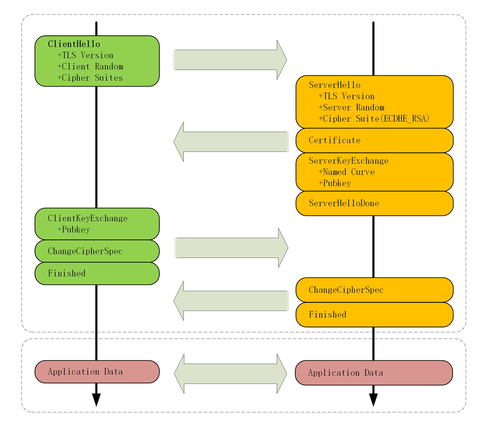
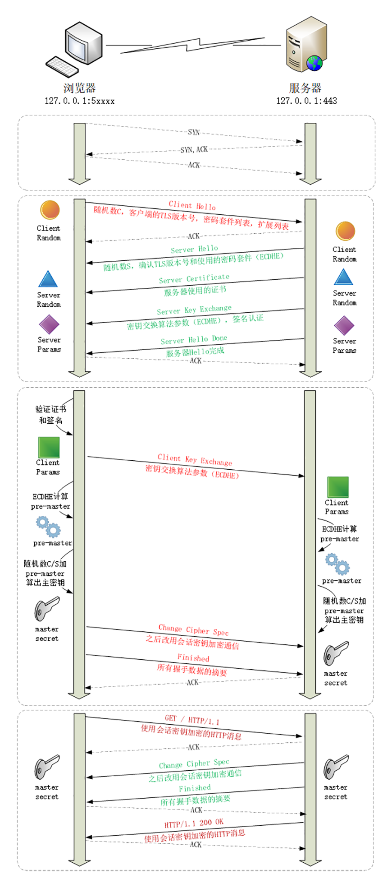
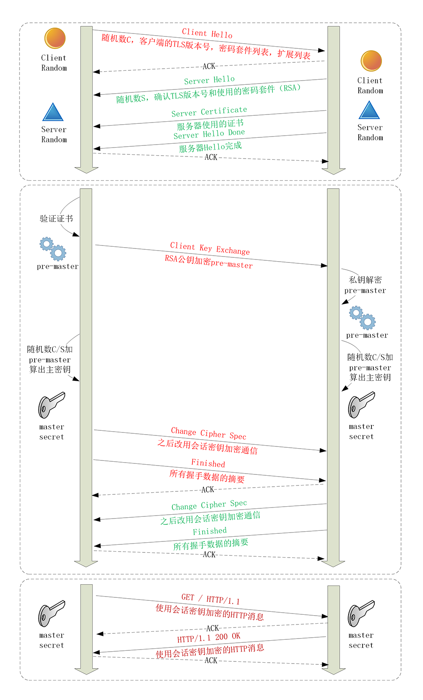

# SSL/TLS

TLS 由记录协议、握手协议、警告协议、变更密码规范协议、扩展协议等几个子协议组成，综合使用了对称加密、非对称加密、身份认证等许多密码学前沿技术。浏览器和服务器在使用 TLS 建立连接时需要选择一组恰当的加密算法来实现安全通信，这些算法的组合被称为“密码套件”（cipher suite，也叫加密套件）。

SSL/TLS分为对称加密和非对称加密两种方式。


# Https的安全性

在机密性的基础上还必须加上完整性、身份认证等特性，才能实现真正的安全.

机密性：加密

完整性：摘要

身份认证：签名

证书：因为谁都可以颁发或者生成公钥，所以需要证书来确定这个公钥是被有效的机构发布的。其他人的我不认。


# TLS 协议

TLS 包含几个子协议，你也可以理解为它是由几个不同职责的模块组成，比较常用的有**记录协议、警报协议、握手协议、变更密码规范协议**等。

* 记录协议（Record Protocol）规定了 TLS 收发数据的基本单位：记录（record）。它有点像是 TCP 里的 segment，所有的其他子协议都需要通过记录协议发出。但多个记录数据可以在一个 TCP 包里一次性发出，也并不需要像 TCP 那样返回 ACK。
* 警报协议（Alert Protocol）的职责是向对方发出警报信息，有点像是 HTTP 协议里的状态码。比如，protocol\_version 就是不支持旧版本，bad\_certificate 就是证书有问题，收到警报后另一方可以选择继续，也可以立即终止连接。
* 握手协议（Handshake Protocol）是 TLS 里最复杂的子协议，要比 TCP 的 SYN/ACK 复杂的多，浏览器和服务器会在握手过程中协商 TLS 版本号、随机数、密码套件等信息，然后交换证书和密钥参数，最终双方协商得到会话密钥，用于后续的混合加密系统。
* 最后一个是变更密码规范协议（Change Cipher Spec Protocol），它非常简单，就是一个“通知”，告诉对方，后续的数据都将使用加密保护。那么反过来，在它之前，数据都是明文的。

下面的这张图简要地描述了 TLS 的握手过程，其中每一个“框”都是一个记录，多个记录组合成一个 TCP 包发送。所以，最多经过两次消息往返（4 个消息）就可以完成握手，然后就可以在安全的通信环境里发送 HTTP 报文，实现 HTTPS 协议。



# ECDHE 握手流程




**客户端和服务器手里都拿到了密钥交换算法的两个参数（Client Params、Server Params），就用 ECDHE 算法一阵算，算出了一个新的东西，叫“Pre-Master”，其实也是一个随机数。**

至于具体的计算原理和过程，因为太复杂就不细说了，但算法可以保证即使黑客截获了之前的参数，也是绝对算不出这个随机数的。

现在客户端和服务器手里有了三个随机数：Client Random、Server Random 和 Pre-Master。用这三个作为原始材料，就可以生成用于加密会 话的主密钥，叫“Master Secret”。而黑客因为拿不到“Pre-Master”，所以也就得不到主密钥。

为什么非得这么麻烦，非要三个随机数呢？

这就必须说 TLS 的设计者考虑得非常周到了，他们不信任客户端或服务器伪随机数的可靠性，为了保证真正的“完全随机”“不可预测”，把三个不可靠的随机数混合起来，那么“随机”的程度就非常高了，足够让黑客难以猜测。

你一定很想知道“Master Secret”究竟是怎么算出来的吧，贴一下 RFC 里的公式：

```
master_secret = PRF(pre_master_secret, "master secret",ClientHello.random + ServerHello.random)
```

这里的“PRF”就是伪随机数函数，它基于密码套件里的最后一个参数，比如这次的 SHA384，通过摘要算法来再一次强化“Master Secret”的随机性。

主密钥有 48 字节，但它也不是最终用于通信的会话密钥，还会再用 PRF 扩展出更多的密钥，比如客户端发送用的会话密钥（client\_write\_key）、服务器发送用的会话密钥（server\_write\_key）等等，避免只用一个密钥带来的安全隐患。

有了主密钥和派生的会话密钥，握手就快结束了。客户端发一个“Change Cipher Spec”，然后再发一个“Finished”消息，把之前所有发送的数据做个摘要，再加密一下，让服务器做个验证。

意思就是告诉服务器：“后面都改用对称算法加密通信了啊，用的就是打招呼时说的 AES，加密对不对还得你测一下。”

服务器也是同样的操作，发“Change Cipher Spec”和“Finished”消息，双方都验证加密解密 OK，握手正式结束，后面就收发被加密的 HTTP 请求和响应了。


# RSA 握手流程




大体的流程没有变，只是“Pre-Master”不再需要用算法生成，而是客户端直接生成随机数，然后用服务器的公钥加密，通过“Client Key Exchange”消息发给服务器。服务器再用私钥解密，这样双方也实现了共享三个随机数，就可以生成主密钥。

# 双向认证

双向认证的流程也没有太多变化，只是在“Server Hello Done”之后，“Client Key Exchange”之前，客户端要发送“Client Certificate”消息，服务器收到后也把证书链走一遍，验证客户端的身份。
