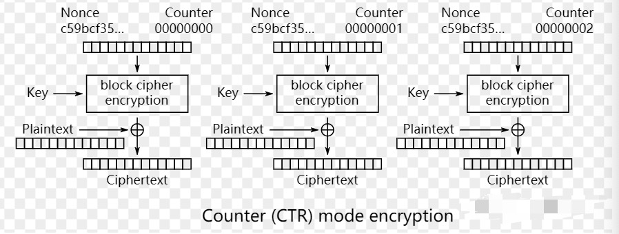

# HASH 算法

# 对称加密算法

什么是对称加密： 指的是，加密和解密使用的是同一个密钥。并且性能比较高。

**DES**：Data Encryption Standard（数据加密标准，又美国国密局，选中的IBM的方案，密钥长度为56，标准提出是要使用64位长的密钥，但是实际中DES算法只用了64位中的56位密钥，这一点是容易出错的）

**3DES**：trip DES（3级DES,是DES的升级版，主要是为了应对快速发展的计算机能力，能够在24小时内暴力破解传统的56位长度密钥的DES,而3DES相当于对统一数据块采用3次DES,3次DES使用的密钥如果完全不同，则密钥长度可以达到168位，大大延长了被暴力破解的时间）

**AES**：Advanced Encryption Standard（高级数据加密标准，是美国国密局为下一代加密算法，挑选的标准）

以上三种都是对称加密算法，且是国际算法，因为都是美国佬搞的，而我国国密局也制定了自己的对称加密算法，叫国密算法，SM1（相当于AES）,和SM4(相当于3DES)。

# 对称加密之 3DES

3DES， TripleDES，是三重数据加密算，相当于是对每个数据应用三次DES的对称加密算法。

3DES 是DES 向AES过度的加密算法，使用2个或者3个56位的密钥对数据进行三次加密。相比DES，3DES 因密钥长度变长，安全性提高，但处理速度不高，因此又出现了AES 加密算法。AES 比较 3DES 速度更快，安全性更高。

加密过程：

明文使用DES 密钥1，进行加密得到密文，然后使用密钥2，对密文进行解密，然后使用密钥3对解密后的密文进行加密。

如果三重密钥均相同，前两步相互抵消，相当于仅实现了一次加密，因此可实现对普通DES加密算法的兼容。

解密过程：

与加密过程相反，即逆序使用密钥，是以密钥3，密钥2，密钥1的顺序执行，解密-》加密-〉解密。

# 对称加密之AES

对称加密算法之AES包括 流密码算法 和 块密码算法，现实中主要是用的是块密码算法。

块密码的实现算法包括：  ECB 模式， CBC 模式，CTR 模式。需要重点掌握CBC和CTR。

AES 工作模式主要包括  ：ECB、CBC、CTR、CFB、OFB。

* ECB模式（默认）：电码本模式 Electronic Codebook Book
* CBC模式：密码分组链接模式 Cipher Block Chaining
* CTR模式：计算器模式 Counter
* CFB模式：密码反馈模式 Cipher FeedBack
* OFB模式：输出反馈模式 Output FeedBack

## 流密码算法之ECB

流密码算法的重要思想：

明文 和 密钥 进行 XOR 运算得到 密文，

密文 和 密钥 再次 XOR 即可还原得到 明文。

原理：  二进制的异或。

缺陷：相同明文就会生成相同的密文。可以使用CBC解决。

## 块密码算法之CBC

加密原理：使用分块 + 向量 + 密钥 进行加密，因为加密的是明文块，所以需要padding。

### 加密：

算法执行流程：

1. 获取初始化向量，IV
2. IV 和第一个明文块进行异或，并将异或后的值使用密钥进行加密，得到密文块0。
3. 使用密文块0 和 明文块1 进行异或。
4. 将异或后的值使用使用密钥加密。
5. 依次类推，直到所有的明文块加密完成。

示意图：

### 解密：

解密流程与加密流程相反即可，

流程：

1. 密文块0 使用 密钥解密，得到 中间解密值0，
2. 使用IV向量和 这个中间解密值0 进行XOR即可得到明文块0，
3. 使用密钥和密文块1进行解密，得到中间解密值1，
4. 使用解密值0 和 中间解密值1 进行XOR 即可得到明文块1，
5. 以此类推，直到所有的块解密完成。

## 流密码算法之CTR

加密原理：使用的是对计数器 进行加密，然后使用加密后的值，再对明文进行XOR得到密文。

因为是对计数器进行加密解密，所以不需要padding。

### 加密

1. 对计数器使用密钥加密，得到blcok cipher
2. 然后是用明文和 block cipher 进行异或，得到密文块0。

### 解密

## AES 之 GCM

### MAC

  Message Authentication Code， 消息验证码。使用密钥和密文生成固定值，

### GMAC：

Galois Message Authentication Code，伽罗瓦消息验证码。是利用Galois Field， GF， 有限域，乘法运算来计算MAC

密文和密文的MAC值跟随密文一起发送，密文接收到之后，可以使用共享的密钥对密文进行MAC值计算，如果与发送过来的MAC值一致，那么说明密文没有被篡改。

CBC 和 CTR 模式都不能校验消息的完整性。

### GCM

GCM：  GMAC  Counter  Mode ，使用了Counter 模式，并且带有GMAC消息认证码，是CTR的增强模式。

GCM：G是 GMAC，C是CTR，提供认证和加密两种功能。

GCM 是将 CTR 计数器模式， 和 GMAC 验证码结合。 这样可以并行地进行加密过程，又可以对信息的完整性进行校验。同时因为计数器模式属于流加密模式，因为GCM中明文不需要进行padding。

# 非对称加密
